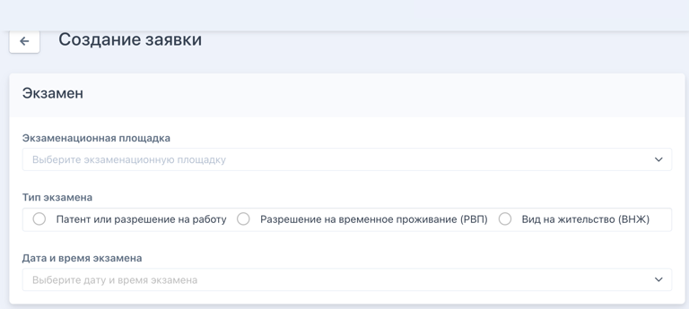
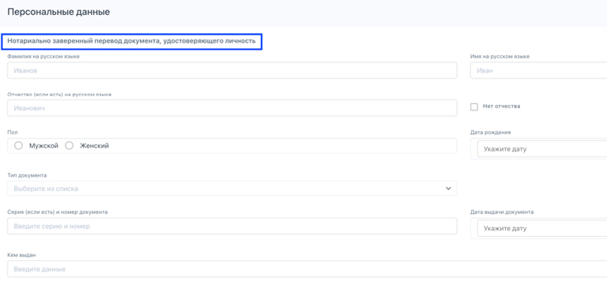
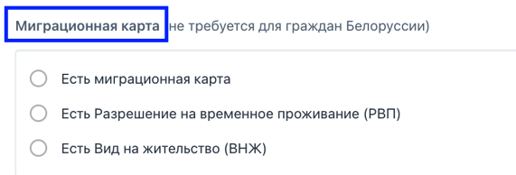
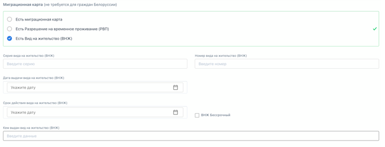
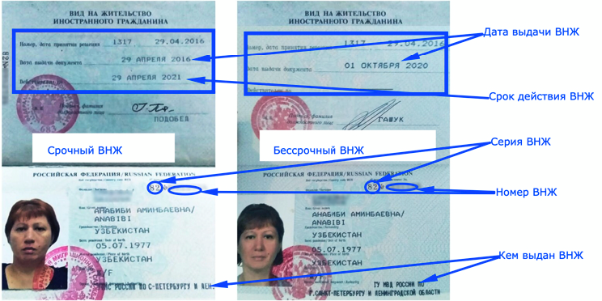

### Блок 1. Экзамен

{width=768px height=345px}

**Экзаменационная площадка** – следует выбрать экзаменационную площадку, где сдающий будет проходить экзамен (если у пользователя доступна только одна площадка, то она будет выбрана по умолчанию).

**Тип экзамена** необходимо установить тип экзамена (уровень), для которого создаётся заявка.

Дата и время экзамена – следует выбрать дату и время экзамена (в списке будут экзамены площадки, где есть свободные места. Все экзамены предварительно должны быть [созданы в  Odin](https://informa.gitbook.io/immigraciya/centr-testirovaniya-v-odin/dobavit-ekzamen)).

### **Блок 2. Персональные данные. Нотариально заверенный перевод документа, удостоверяющего личность**

{width=768px height=360px}

Сотрудник экзаменационной площадки начинает заполнение данных по заявке с данных, указанных в нотариально заверенном переводе паспорта (либо из удостоверения личности, если это гражданин Казахстана и он подает заявку по удостоверению)

:::note 

Важно! Перевод должен быть именно того документа, с которым сфотографирован гражданин. Этот же перевод должен быть загружен в заявку во Flow.

:::

**Фамилия на кириллице** – указывается фамилия из перевода к паспорту в точности так, как в переводе.

**Имя** – указывается имя из перевода к паспорту, в точности так, как указано в переводе

**Отчество** – если в переводе к паспорту отчества на кириллице нет, значит, необходимо отметить галочку "Нет отчества", оставляя текстовое поле пустым, но, если в паспорте есть перевод для отчества, значит, необходимо вписать его из перевода так же, как в переводе.

**Пол** – указывается пол из перевода к паспорту

**Дата рождения** в формате дд.мм.гггг – указывается дата рождения из перевода (необходима сверка с оригиналом документа)

### Категории граждан, которые не должны сдавать экзамен по русскому языку для получения РВП или ВНЖ

Это три категории граждан:

-  лица моложе 18 лет,

-  мужчины старше 65 лет,

-  женщины старше 60 лет

В системе добавлена проверка на эти условия. На странице создания/редактирования заявки, если выбран один из типов экзамена РВП или ВНЖ **И** указан возраст сдающего моложе 18 лет/мужчина старше 65 лет/женщины старше 60 лет, добавлено сообщение:

“Лица моложе 18 лет/старше 60/65 лет освобождаются от сдачи экзамена для получения разрешения на временное проживание (РВП) или вида на жительство (ВНЖ)

Данное правило действует в соответствие с пунктом 5, ст. 15.1 Закона от 25 июля 2002 г. N 115-ФЗ "О правовом положении иностранных граждан в Российской Федерации. Если дата рождения указана неверно, пожалуйста, исправьте её. Если дата указана верно, но экзамен по каким-либо причинам и требованиям нужен, продолжите заполнение заявки".

При этом оплата заявки не блокируется. Сообщение выводиться только для информации.

### **Тип документа, удостоверяющего личность** – это может быть:

-  загранпаспорт

-  удостоверение личности гражданина

-  удостоверение личности лица без гражданства (для лиц без гражданства подходят также РВП или ВНЖ, для остальных граждан (имеющих какое-то гражданство), ВНЖ или РВП не являются документами, удостоверяющими личность)

-  удостоверение беженца

-  свидетельство о предоставлении временного убежища на территории РФ.

**Серия и номер документа**, для которого сделан перевод, заполняется также, как в переводе (требуется сверка серии и номер документа в переводе и в оригинале документа).

**Дата выдачи документа** в формате дд.мм.гггг. заполняется из перевода (требуется сверка даты выдачи документа в переводе и в оригинале документа).

**Кем выдан** – указываем обязательно **на кириллице** и только так, как идет в переводе к паспорту.

### **Блок 3. Персональные данные. Документ, удостоверяющий личность**

Далее сотрудник экзаменационной площадки заполняет данные из паспорта/документа, удостоверяющего личность.

{width=768px height=245px}

**Фамилия на латинице** заполняется на латинице из документа, удостоверяющего личность.

**Имя на латинице** заполняется на латинице из документа, удостоверяющего личность.

**Имя на латинице** заполняется на латинице из документа, удостоверяющего личность. Если в паспорте отчества на латинице нет, значит, необходимо отметить галочку "Нет отчества".

**Гражданство** - указывается страна, гражданином которой является иностранный гражданин.

### **Блок 4. Персональные данные. Адрес регистрации по месту пребывания**

Сотрудник экзаменационной площадки проверяет документ с регистрацией сдающего:

-  документ о постановке на миграционный учет,

-  основание регистрации (штамп в паспорте или в ВНЖ)

{width=768px height=206px}

**Регион** - в выпадающем списке необходимо выбрать регион РФ, где зарегистрирован сдающий. Например, Томская область, Красноярский край или Луганская Народная Республика.

**Населённый пункт.** После выбора региона в выпадающем списке "Населенный пункт" появятся города, районы и т.д., например, г. Томск, г. Асино, Верхнекетский район РП Белый Яр и т.д. Необходимо выбрать указанный в документе, подтверждающем регистрацию.

**Улица** необходимо указать название улицы/переулка/проспекта, например: Учебная, Комсомольский проспект и т.д. ( «ул.» писать не следует).

**Дом** - введите номер дома (при необходимости следует добавить строение и т.п.), например, 48а стр. 3, или 15/1 и т.п.

**Квартира** - номер квартиры или помещения. Если номер квартиры или помещения отсутствует в документе, то необходимо поставить прочерк "-"(дефис).

### **Блок 5. Персональные данные. Миграционная карта (не требуется для граждан Белоруссии**

Следующий документ - документ, подтверждающий законное нахождение человека в стране. Следует выбрать что это:

-  миграционная карта

-  РВП

-  ВНЖ

{width=571px height=194px}

[tabs]

[tab:Миграционная карта]

{width=768px height=196px}

**Серия** - 4 верхние цифры на миграционной карте

**Номер карты** \- нижние цифры сразу под серией

**Срок пребывания с** - дата выдачи миграционной карты на штемпеле. Заполняется в формате дд.мм.гггг.

**Срок пребывания по** - до какой даты действует миграционная карта. Заполняется в формате дд.мм.гггг.

**!Важно, информация "до какой даты действует миграционная карта" не обязательно заполнена на лицевой стороне МК. Продление срока обычно выставлено на оборотной стороне МК или на приложениях к МК. Необходимо выбрать последний штемпель, чтобы удостовериться, что МК не просрочена.**

[/tab]

[tab:РВП]

{width=768px height=197px}

РВП - печать в паспорте. Необходимо заполнить:

-  Номер РВП

-  Дату принятия решения

-  Срок действия РВП

{width=768px height=454px}

[/tab]

[tab:ВНЖ]

ВНЖ может быть со сроком действия или бессрочный.

{width=768px height=293px}

В соответствии с документов заполняются следующие поля:

-  Серия вида на жительство (ВНЖ)

-  Номер вида на жительство (ВНЖ)

-  Дата выдачи вида на жительство (ВНЖ)

-  Срок действия вида на жительство (ВНЖ)/отмечается галочка "ВНЖ Бессрочный"

-  Кем выдан вид на жительство (ВНЖ)

{width=744px height=372px}

[/tab]

[tab]

[/tab]

[/tabs]

### **Блок 6. Персональные данные. Контакты**

{width=768px height=95px}

Контакты заполняются со слов сдающего или можно попросить написать их на бумаге, затем напечатать в соответствующих полях.

:::note 

Электронная почта необходима для генерации ссылки на оплату, на эту почту придёт чек.

При использовании оплаты посредством qr-кода, чек будет на руках у сдающего.

:::

### **Блок 7. Заявление**

В данном блоке на основании заполненных выше данных будет сгенерировано заявление для сдающего. Его необходимо распечатать и дать человеку ознакомиться и подписать.

{width=768px height=55px}

### **Загрузка сканов документов**

Все документы, предоставленные сдающим, необходимо отсканировать и загрузить в соответствующее окошко и нажать "Загрузить".

{width=768px height=494px}

 **1\. Нотариально заверенный перевод паспорта -** переводы могут быть разных форматов. Бывают переводы, где всего один лист, на котором все сразу есть и данные паспорта переведенные, и печать и копия первой страницы паспорта (самый простой) – тогда достаточно сделать только скан этого всего перевода, но бывают и переводы на 2 и более страниц. Важно, чтобы был скан переведенных данных и скан нотариального заверения перевода. Для больших полных переводов допускается делать дополнительно скан первой страницы (где скан разворота паспорта с персональными данными, которые затем будут в документе переведены), но эта страница является необязательной, т.к. не во всех переводах она присутствует.

 **2\. Документ, удостоверяющий личность -** прикладывается скан разворота документа, удостоверяющего личность, данные которого были внесены в анкету ранее.

 **3\. Регистрация** – прикладываем либо скан постановки на миграционный учет (обе стороны документа), либо скан разворота паспорта или ВНЖ, где проставлена действующая регистрация.

 **4\. Миграционная карта** (если выбрано, что есть МК) – загружается скан МК. Если срок действия "до" не закончился и не закончится по срокам до сдачи экзамена, то достаточно только первой стороны МК, если же есть продления срока на МК, то прикладывается и оборотная сторона, или все приложения к МК.

**РВП** (если 5 выбрано, что есть РВП) - вместо МК загружается скан разворота паспорта, где стоит штамп о РВП.

**ВНЖ** ( если выбрано, что есть ВНЖ) - вместо МК загружается разворот с данными сдающего из этого документа, как показано на картинке с примером по ВНЖ

 **5\. Заявление** – здесь прикладывается скан двух сторон подписанного заявления. Необходимо проверить, все ли подписи стоят, правильно ли заполнены все данные в заявлении

 **6\. Фотография**. Ознакомьтесь с требования ниже:

-  На фото сдающий должен держать рядом с лицом развернутый паспорт (документ, удостоверяющий личность)

-  Разрешение фотографии должно составлять не менее 1772x2480 или 2480x1772 точек.

-  Формат фото: BMP / JPEG / PNG, цветное изображение

-  Паспорт на фото должен хорошо просматриваться

-  Фон не должен быть абсолютно белым

-  Лицо на фото должно быть полностью видно, без эффекта «красных глаз»

:::note 

Важно, чтобы гражданин фотографировался именно с тем документом, данные которого были вписаны при создании заявки.

:::

### **Про опечатки**

Часто встречаются случаи, когда представители экзаменационных площадок вносят данные граждан с опечатками во Flow. На основании этих данных (ФИО и дата рождения) в Odin регистрируется сдающий.

При внесении изменений во Flow эти изменения автоматически подтягиваются в Odin.